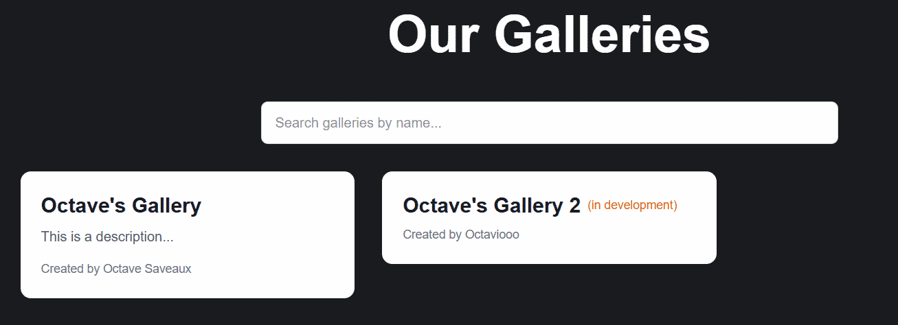
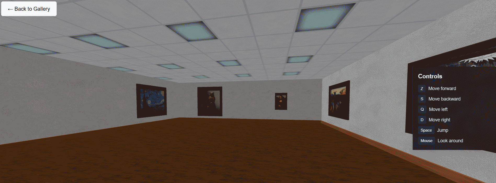
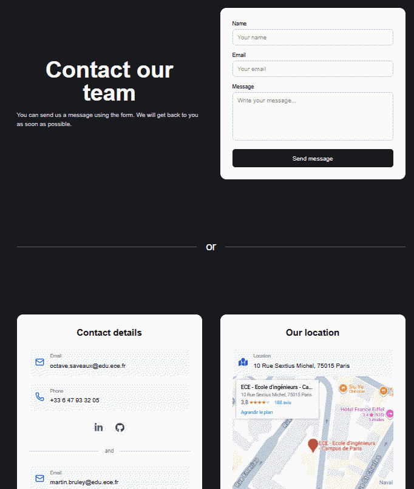
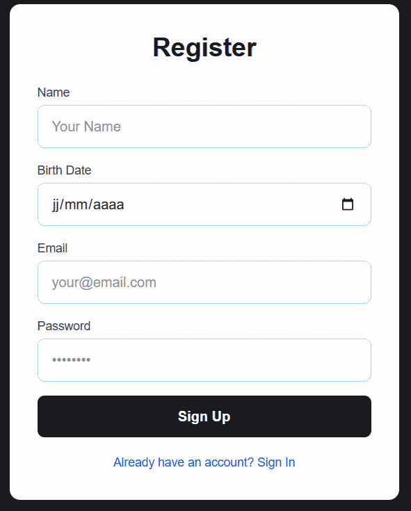
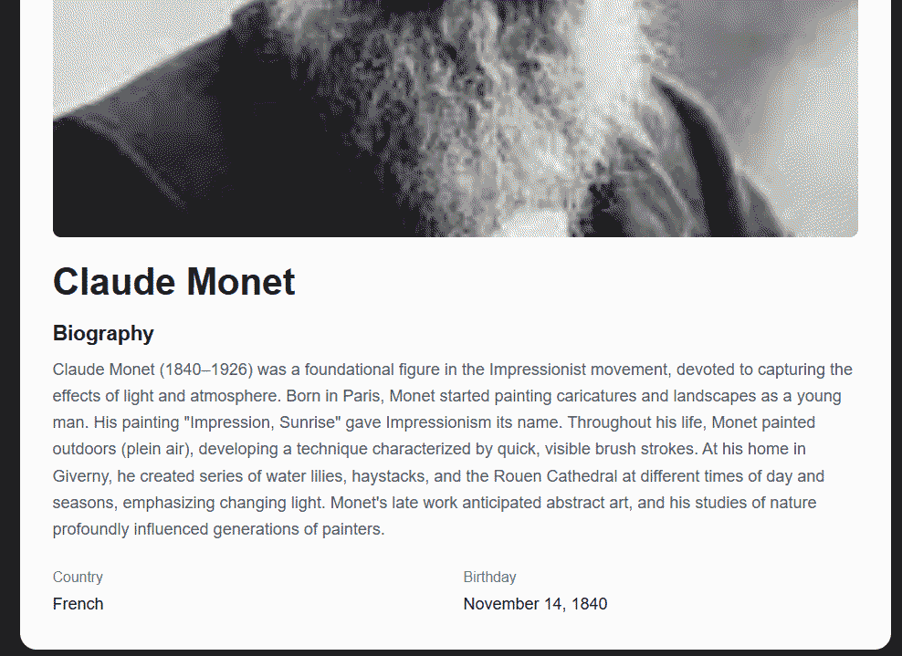
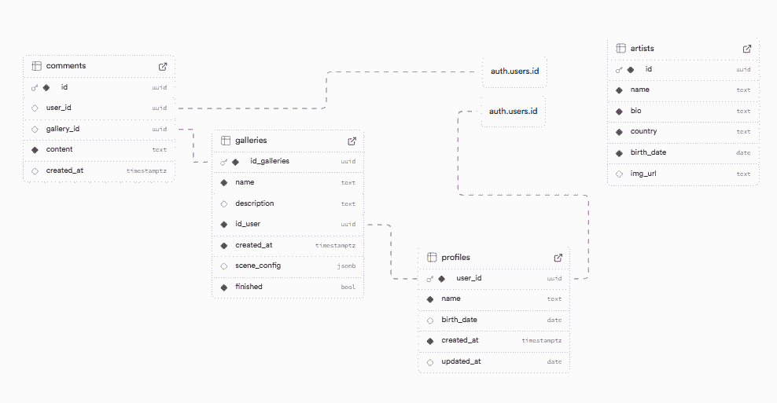
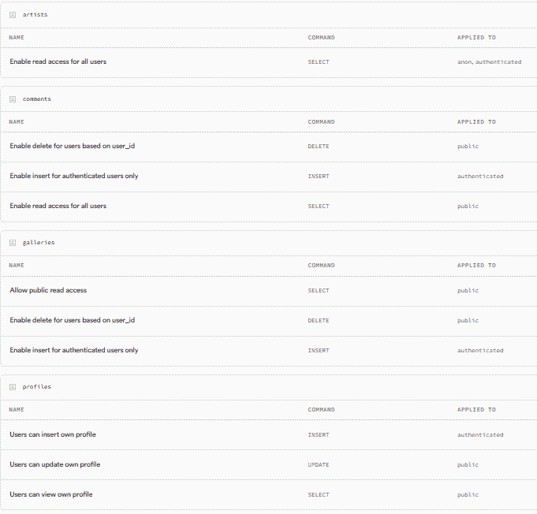

# Project Name: Webtech-108

- **Team Members:**
  - Octave SAVEAUX
  - Martin BRULEY
- **Deployed URL:** [webtech-108.vercel.app](webtech-108.vercel.app)

---

## 1. Concept & User Experience

### Key Features (UI/UX)

---

## 2. Full-Stack Functionality

### Authentication

- [x] Sign-up implemented
- [x] Sign-in implemented
- [x] Sign-out implemented
- [x] The UI updates based on user state

**Notes**: Authentication is implemented with Supabase Auth. Users can register with Name, email, birth date and the password. The navbar displays the login/register buttons or user profile/logout. Profile creation is automatic upon registration.

**Self-Evaluation:**: Authentication is fully functional. The UI correctly reflects user state throughout the application. Profile management includes name editing with a 5-day cooldown period.

### CRUD Operations

- **Main Resource:** Galleries
- [x] Create
- [x] Read
- [x] Update
- [x] Delete

**Notes**: Users can create galleries with a name, description, and choose from 3 predefined layouts (Large Open Room, Divided Space or Small Room). Galleries can be viewed in a list or detail view (dynamic routing). Gallery owners can update the "finished" status (toggle between "Finished" and "In Development"). Gallery owners can delete their own galleries.

**Self-Evaluation:**: All CRUD operations are implemented for galleries. Create includes form validation and layout selection. Read displays galleries with creator information. Update allows toggling the finished status. Delete includes a confirmation message.

### Data Relationships

- **Tables Involved:** Galleries and Profiles, Galleries and Comments, Comments and Profiles
- [x] Relationship implemented

**Notes**: 
- **Galleries and Profiles**: Each gallery has a foreign key "id_user" linking to the "profiles" table. The gallery detail page displays the creator's name using this relationship.
- **Galleries and Comments**: Comments table has "gallery_id" foreign key linking to galleries. Each gallery can have multiple comments.
- **Comments and Profiles**: Comments table has "user_id" foreign key linking to profiles. Comments display the author's name using this relationship.

**Self-Evaluation:**: All relationships are properly implemented with foreign keys in Supabase. The application correctly fetches and displays related data using Supabase joins.

### Search & Filtering

- [x] Search implemented
- [ ] Filter implemented, available options: [Not yet implemented]

**Notes**: Search functionality is implemented on the galleries page. Users can search galleries by name. Search is performed client-side on the fetched gallery list. Filter functionnality can be added in the future.

**Self-Evaluation:**: Search is functional and provides good results. The filtering functionnality could be added as an improvement.

### External API Integration

- **API Used:** Resend (https://resend.com) - Email API
- **Data fetched:** Contact form submissions are sent via email using Resend API

**Notes**: The contact form uses the Resend API to send emails when users submit the contact form. The API is called from a Next.js API route (/api/contact/route.js).

**Self-Evaluation:**: External API integration is implemented for the contact form. The Resend API is used to send emails with contact form data.

---

## 3. Engineering & Architecture

### Database Schema

**Notes**: 
- **artists**: Stores artist information (id, name, bio, country, birth_date, image_url)
- **galleries**: Stores gallery data (id_galleries, name, description, id_user, finished, scene_config, created_at)
- **profiles**: User profiles linked to auth.users (user_id, name, birth_date, created_at, updated_at)
- **comments**: User comments on galleries (id, user_id, gallery_id, content, created_at)

Relationships:
- galleries.id_user → profiles.user_id
- comments.user_id → profiles.user_id
- comments.gallery_id → galleries.id_galleries

**Self-Evaluation:**: Database schema is structured with good foreign key relationships.

### Row Level Security (RLS)

**Notes**: RLS policies are configured to ensure data security:
- **Artists**: SELECT only (public read access, no write access)
- **Comments**: DELETE, INSERT, SELECT (users can create and delete their own comments, view all comments)
- **Galleries**: DELETE, INSERT, SELECT (users can create and delete their own galleries, view all galleries)
- **Profiles**: DELETE, INSERT, SELECT (users can create and delete their own profile, view all profiles)

**Self-Evaluation:**: RLS policies are properly configured. Users can only insert/delete their own data (galleries, comments, profiles). Artists table is read-only for all users. This ensures data security and prevents unauthorized modifications.

### Server vs. Client Components

**Server Component:** `src/app/artists/page.js`
    - This is an async server component that directly fetches data from Supabase using `supabaseServer` on the server side. It ensures better SEO, faster initial page load. The data is fetched before the page is rendered, providing a better user experience.

**Client Component:** `src/components/navbar.js`
    - This component needs to use React hooks (`useState`, `useEffect`) to manage user authentication state, handle interactive elements like the mobile menu toggle, and respond to user interactions (login/logout, profile editing).

---

## 4. Self-Reflection & Feedback

### Proudest Achievement

*What is the technically most difficult or most polished feature you built?*

**Octave SAVEAUX**: The 3D gallery scene with interactive navigation and collision detection. Creating a fully playable 3D environment where users can walk around galleries was the most challenging part. I'm also proud of the contact form that sends emails using the Resend API, with a nice HTML email template.

**Martin BRULEY**: Working on the footer component and improving the styling consistency across different pages. I helped design and implement the contact page layout with the form structure and styling. Also contributed to various UI improvements throughout the application to ensure a cohesive user experience. The responsive design work on several pages was also part of my contribution.

### What Would You Improve?

*If you had more time, what would you add or improve in your project?*

**Octave SAVEAUX**: I would fix the 3D scene loading issue and optimize resource loading for better performance. I would also improve the choice of the gallery layout, we propose to the user to chose dynamically the gallery layout. Front-end improvements like better responsive design and UI consistency across pages would enhance the user experience. Adding the ability to upload and place paintings in galleries would also be a great feature.

**Martin BRULEY**: I would add filtering options for galleries (by creator, date, finished status) and improve the search functionality to search by description or creator name in addition to gallery name. I could also work on improving the UI/UX of some forms, adding more visual feedback for user actions, and implementing a gallery preview image feature.

### Course Feedback (Bonus)

*What did you enjoy about this course? What could be improved for next year?*

**Octave SAVEAUX**: The course was very well structured and the explanations were clear and the content was complete. I really appreciated the progressive approach where we built the project lab after lab, it allowed us to create the website step by step and understand each concept as we implemented it. However, sometimes it was a bit unclear what exactly we needed to have implemented for the next lab session. It would be helpful to have a clearer checklist or summary of requirements between labs. Overall, the project-based learning approach was very effective and made the concepts much easier to understand in practice.

**Martin BRULEY**: The course was in it's globality very well constructed. If I had to find an improvement, I'dd say maybe a video support could help, but it isn't necessery and would very much be an plus.
